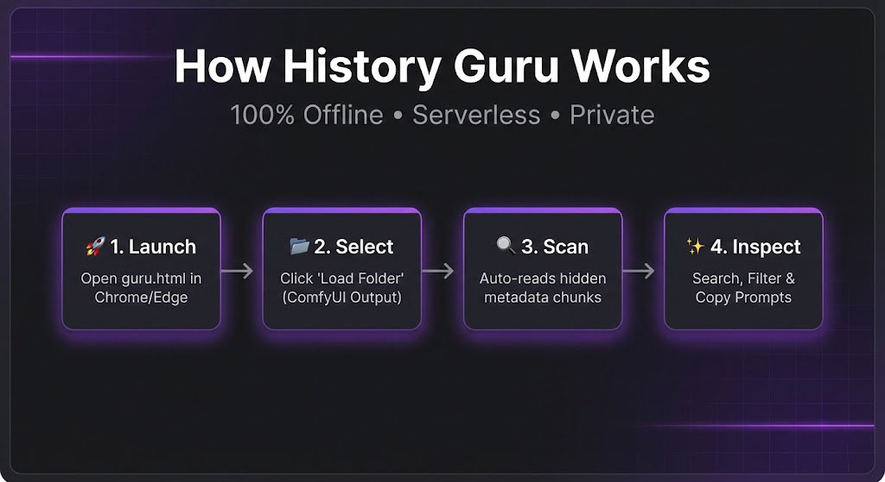

# History Guru 🧘‍♂️ v4.0 (The Manager Update)

> **The 100% Offline, Single-File File Manager & Metadata Viewer for AI Images.**

**History Guru** has evolved. It is no longer just a viewer—it is a full-fledged **Local File Manager** for your ComfyUI and A1111 output folders.

You can now **organize, sort, move, and fix** your AI generations without ever leaving the metadata view. It runs entirely in your browser using the modern *File System Access API*.

## ✨ What's New in v4.0?

* **📂 True File Management:** You can now **create real folders** and **move files** on your hard drive directly from the interface.
* **Drag-and-drop Sorting:** Simply drag an image from the grid into a folder in the sidebar to move it. Perfect for separating "Keepers" from "Trash."
* **🚀 Virtual Scrolling:** Handles **650+ images** smoothly with virtual scrolling. Only visible items are rendered, ensuring smooth performance even with thousands of images.
* **🎬 Cinema Mode:** A new split-screen "Detail View." Click an image to see it full-height on the left while editing metadata on the right. Supports keyboard navigation (Arrow Keys) for fast review.
* **🎥 Video Support:** Now supports playing and organizing `.mp4` and `.webm` files (Sora/AnimateDiff workflows) alongside your images.
* **💾 Instant Fix & Save:** The "Fix Metadata" button no longer downloads a file to your "Downloads" folder. It now **writes the fixed image directly to your disk** (next to the original), injecting the missing metadata losslessly.
* **⭐ Favorites System:** Star your favorite images for quick access. Filter to show only favorites with one click.
* **🔍 Enhanced Metadata Parsing:** Now supports Civitai metadata formats, including "prompt" and "workflow" chunks. Handles both ComfyUI workflow formats (direct nodes and nodes array).
* **📊 Sort Options:** Sort images by name, date modified, or date created.
* **⌨️ Keyboard Shortcuts:** Comprehensive keyboard navigation and shortcuts (press `?` for help).
* **❓ Help System:** Built-in help overlay showing all functions and keyboard shortcuts.
* **🗑️ Context Menu:** Right-click files and folders for quick actions (delete, etc.).

## 🧠 Core Features (Retained)

* **⚡ Instant Search:** Filter thousands of images by Prompt, Model Name, Seed, or LoRA Name in milliseconds.
* **✏️ Metadata Editor:** Manually edit missing or broken metadata fields (Prompt, Seed, Steps, etc.) directly in the sidebar.
* **🕸️ Deep Recursive Tracing:** The "Brain" of the operation. It recursively traces upstream nodes to find prompts hidden behind `SeedVarianceEnhancers`, `Logic Gates`, or complex `Lora Stackers` that standard viewers miss.
* **🔒 100% Private:** Zero server uploads. Your images never leave your hard drive.
* **📱 Multiple View Modes:** Grid view, List view, and Statistics view for different browsing needs.
* **🌓 Theme Toggle:** Switch between dark and light themes with persistent preference storage.
* **📈 Statistics Dashboard:** View comprehensive metadata analytics including model usage, LoRA popularity, and more.

## 🚀 Quick Start

### For Chrome/Edge/Opera Users (Full Features)

1.  **Download** the `Guru Manager.html` file from the root directory of this repository.
2.  **Open** the file in **Chrome, Edge, or Opera**.
3.  Click **"Open Folder"** and select your ComfyUI/Output directory.
4.  **Grant Permission:** Your browser will ask if the site can "View and Edit" files. You **must click "Edit"** (or Allow) for the file manager features to work.
5.  **Organize:** Right-click the sidebar to create folders. Drag and drop images to move them. Click images to view metadata.
6.  **Explore:** Use keyboard shortcuts (press `?` for help), star favorites, sort by different criteria, and view statistics.

### For Firefox Users (View-Only Mode)

1.  **Download** the `Guru Universal Node Version 3.3.html` file from the root directory of this repository.
2.  **Open** the file in **Firefox**.
3.  Click **"Load Folder"** and select your ComfyUI/Output directory.
4.  **Browse:** Click images to view metadata in full-screen detail view. Use arrow keys to navigate between images.
5.  **Explore:** Use keyboard shortcuts (press `?` for help), star favorites, sort by different criteria, and view statistics.

**Note:** The Firefox edition provides all viewing and metadata features, but does not support file operations (create, move, delete) due to browser API limitations.

## ⌨️ Keyboard Shortcuts

* `G` - Switch to Grid view
* `L` - Switch to List view
* `S` - Switch to Statistics view
* `T` - Toggle theme (dark/light)
* `?` - Show help overlay
* `F` - Focus search box
* `R` - Refresh folder
* `Arrow Keys` - Navigate in detail view
* `Enter` - Open selected image
* `Delete` - Delete selected item
* `Esc` - Close overlays / Exit detail view

Press `?` anytime to see the full list of shortcuts and features.

## ⚠️ Browser Compatibility

**Version 4.0 requires a browser that supports the *File System Access API*.**

| Browser | Status | Notes |
| :--- | :--- | :--- |
| **Google Chrome** | ✅ **Supported** | Recommended - Full file management features |
| **Microsoft Edge** | ✅ **Supported** | Recommended - Full file management features |
| **Opera** | ✅ **Supported** | Works out of the box - Full file management features |
| **Firefox** | ✅ **Supported (v3.3)** | Use `Guru Universal Node Version 3.3.html` - View-only mode (no file operations) |
| **Safari** | ❌ **Not Supported** | Missing API support. |

### Firefox Edition (v3.3)

The **Firefox Edition** (`Guru Universal Node Version 3.3.html`) provides the same UI/UX experience as v4.0, but without file management features (since Firefox doesn't support the File System Access API).

**✅ Available in Firefox Edition:**
- ⭐ Favorites system with filter
- 🔍 Full metadata search and parsing
- 📊 Sort by name, date modified, or date created
- 🌓 Theme toggle (dark/light)
- ⌨️ Keyboard shortcuts (press `?` for help)
- 🖼️ Full-screen detail view with arrow key navigation
- ❓ Help system overlay
- 🚀 Enhanced metadata parsing (ComfyUI, Civitai, A1111)
- 📈 Statistics dashboard
- 📱 Multiple view modes (Grid, List, Statistics)

**❌ Not Available in Firefox Edition:**
- File/folder creation
- Drag-and-drop file moving
- Direct file deletion
- Metadata fixing/saving (requires File System Access API)

**Usage:** Open `Guru Universal Node Version 3.3.html` in Firefox, click "Load Folder" to select your image directory.

## 🔧 Technical Details

History Guru v4 uses a hybrid engine:
* **File System Access API:** Gives the browser direct read/write access to a specific folder on your user's command. This allows for real file operations (Move/Rename/Create) without a backend server.
* **IndexedDB Caching:** To handle folders with thousands of images, metadata is parsed once and stored in the browser's internal database. Subsequent loads are instant.
* **Virtual Scrolling:** For collections with 100+ images, only visible items are rendered, dramatically improving performance and memory usage.
* **Recursive Node Tracing:** Traces `positive` -> `conditioning` -> `node` links upwards endlessly until it finds the original text prompt.
* **CRC32 Binary Injection:** Calculates valid checksums to insert new `tEXt` chunks into existing PNG binaries without re-encoding the image pixel data (lossless patching).
* **Enhanced Metadata Parsing:** Supports multiple ComfyUI workflow formats (direct node objects and nodes array), Civitai "prompt" chunks, and A1111 parameters format.
* **Debounced Scroll Events:** Optimized scroll handling with 16ms throttling for smooth virtual scrolling performance.

## 📋 Supported Metadata Formats

* **ComfyUI Workflows:** Full support for ComfyUI workflow JSON in "workflow" and "prompt" chunks
* **Civitai Format:** Supports Civitai's metadata format with "prompt" chunks
* **A1111 Parameters:** Automatic1111-style text parameters
* **PNG Text Chunks:** tEXt, iTXt, and zTXt (compressed) chunks
* **JPEG/EXIF:** Basic EXIF metadata detection
* **WebP:** WebP image format support
* **MP4/WebM:** Video file support for Sora/AnimateDiff workflows

## 🎯 Performance Features

* **Virtual Scrolling:** Automatically activates for folders with 100+ images
* **IndexedDB Caching:** Metadata is cached for instant subsequent loads
* **Debounced Events:** Scroll and resize events are optimized for performance
* **Lazy Image Loading:** Images load on-demand as you scroll

## 📁 Project Structure

Files are organized into folders:
- Root directory - Main HTML applications (`Guru Manager.html`, `Guru Universal Node Version 3.3.html`)
- `apps/` - Development copies and additional HTML files
- `tools/` - AI development tools (Python scripts)
- `docs/` - Documentation files
- `data/` - Reference databases (JSON)
- `test-data/` - Test images
- `backup/` - Automatic backups

See `INDEX.md` for a complete file index.

## 🤝 Contributing

Feel free to fork this repository and submit Pull Requests.

**License:** MIT
**Created by:** The Community & The AI Assistant
